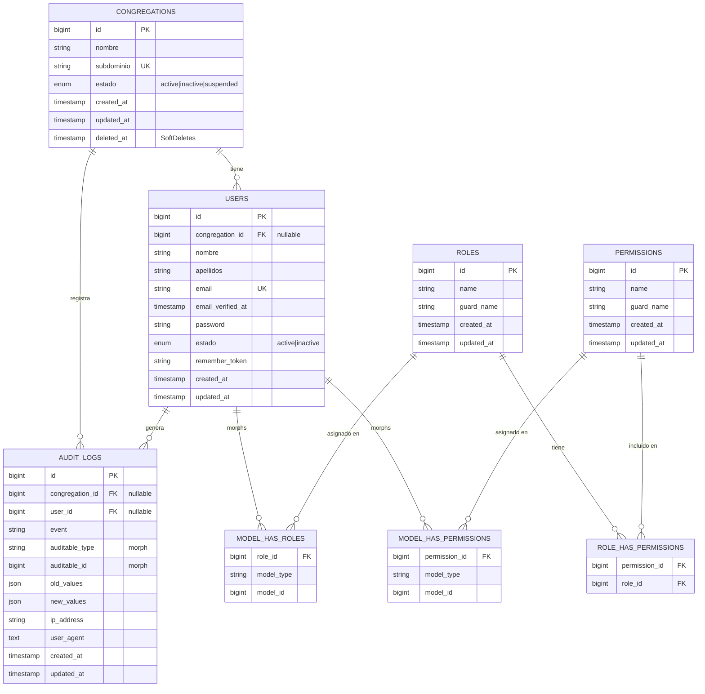

# Análisis y diseño — reuniones-jw

> Documento de **diseño** (fase previa al código). Define el modelo de datos,
> las relaciones, el diagrama entidad-relación, la estrategia multi-congregación,
> el esquema de roles/permisos y el roadmap de módulos futuros.

---

## 1. Modelo de base de datos completo

El modelo se divide en tres bloques:

1. **Núcleo de negocio**: `congregations`, `users`.
2. **RBAC (Spatie)**: `roles`, `permissions`, `model_has_roles`,
   `model_has_permissions`, `role_has_permissions`.
3. **Auditoría**: `audit_logs` (creada desde el MVP).
4. **Autenticación/infraestructura Laravel**: `password_reset_tokens`,
   `sessions`, `cache`, `jobs` (estándar de Laravel 12).

> Nota: el enunciado original mencionaba una tabla `role_user`. Al adoptar
> **spatie/laravel-permission**, esa tabla se reemplaza por las tablas estándar
> de Spatie (`model_has_roles`, etc.). No se crea una tabla pivote propia.

### 1.1 Tabla `congregations`

Entidad raíz del modelo multi-tenant. Cada dato del sistema cuelga de aquí.

| Columna       | Tipo                | Restricciones                       | Descripción                          |
|---------------|---------------------|-------------------------------------|--------------------------------------|
| `id`          | BIGINT UNSIGNED     | PK, auto-increment                  | Identificador                        |
| `nombre`      | VARCHAR(150)        | NOT NULL                            | Nombre de la congregación            |
| `subdominio`  | VARCHAR(100)        | NOT NULL, UNIQUE                    | Subdominio único (tenant)            |
| `estado`      | ENUM('active','inactive','suspended') | NOT NULL, DEFAULT 'active' | Estado operativo            |
| `created_at`  | TIMESTAMP           | nullable                            | Alta                                 |
| `updated_at`  | TIMESTAMP           | nullable                            | Última modificación                  |
| `deleted_at`  | TIMESTAMP           | nullable (SoftDeletes)              | Borrado lógico (mantiene historial)  |

Índices: `UNIQUE(subdominio)`, `INDEX(estado)`.

> **Persistencia:** no se permite borrado físico. Se usa **SoftDeletes**
> (`deleted_at`) para conservar el historial. La desactivación operativa se hace
> con `estado = 'inactive'`. El estado `suspended` permite una baja temporal
> (p. ej. impago/revisión) distinta de la desactivación definitiva.

### 1.2 Tabla `users`

| Columna             | Tipo              | Restricciones                                  | Descripción                  |
|---------------------|-------------------|------------------------------------------------|------------------------------|
| `id`                | BIGINT UNSIGNED   | PK, auto-increment                             | Identificador                |
| `congregation_id`   | BIGINT UNSIGNED   | FK → `congregations.id`, NULLABLE, ON DELETE RESTRICT | Tenant del usuario     |
| `nombre`            | VARCHAR(100)      | NOT NULL                                       | Nombre                       |
| `apellidos`         | VARCHAR(150)      | NOT NULL                                       | Apellidos                    |
| `email`             | VARCHAR(190)      | NOT NULL, UNIQUE                               | Correo / login               |
| `email_verified_at` | TIMESTAMP         | nullable                                       | Verificación (Laravel)       |
| `password`          | VARCHAR(255)      | NOT NULL                                       | Hash bcrypt/argon2           |
| `estado`            | ENUM('active','inactive') | NOT NULL, DEFAULT 'active'             | Desactivación lógica         |
| `remember_token`    | VARCHAR(100)      | nullable                                       | "Recuérdame" (Laravel)       |
| `created_at`        | TIMESTAMP         | nullable                                       | Alta                         |
| `updated_at`        | TIMESTAMP         | nullable                                       | Última modificación          |

Índices: `UNIQUE(email)`, `INDEX(congregation_id)`, `INDEX(estado)`.

> `congregation_id` es **NULLABLE** a propósito: el **SuperAdministrador** es un
> usuario global que no pertenece a ninguna congregación (`congregation_id = NULL`).

### 1.3 Tablas de Spatie (RBAC)

Generadas por la migración del paquete `spatie/laravel-permission`. Estructura
estándar:

- **`roles`**: `id`, `name`, `guard_name`, `created_at`, `updated_at`
  (+ `team_id` si se activa el modo *teams* — ver §5.3).
- **`permissions`**: `id`, `name`, `guard_name`, `created_at`, `updated_at`.
- **`model_has_roles`**: `role_id`, `model_type`, `model_id` (asigna roles a usuarios).
- **`model_has_permissions`**: `permission_id`, `model_type`, `model_id`
  (permisos directos a usuarios).
- **`role_has_permissions`**: `permission_id`, `role_id` (permisos de cada rol).

### 1.4 Tabla `audit_logs`

Registro de auditoría, creado desde el MVP para soportar trazabilidad futura.

| Columna           | Tipo                | Restricciones                                  | Descripción                              |
|-------------------|---------------------|------------------------------------------------|------------------------------------------|
| `id`              | BIGINT UNSIGNED     | PK, auto-increment                             | Identificador                            |
| `congregation_id` | BIGINT UNSIGNED     | FK → `congregations.id`, NULLABLE, ON DELETE SET NULL | Tenant (NULL = acción global SuperAdmin) |
| `user_id`         | BIGINT UNSIGNED     | FK → `users.id`, NULLABLE, ON DELETE SET NULL  | Autor de la acción                       |
| `event`           | VARCHAR(50)         | NOT NULL                                       | `created`, `updated`, `deleted`, `login`, `logout`… |
| `auditable_type`  | VARCHAR(255)        | NULLABLE                                       | Modelo afectado (morph)                  |
| `auditable_id`    | BIGINT UNSIGNED     | NULLABLE                                       | ID del modelo afectado (morph)           |
| `old_values`      | JSON                | NULLABLE                                       | Valores anteriores                       |
| `new_values`      | JSON                | NULLABLE                                       | Valores nuevos                           |
| `ip_address`      | VARCHAR(45)         | NULLABLE                                       | IP de origen (IPv4/IPv6)                 |
| `user_agent`      | TEXT                | NULLABLE                                       | Navegador/cliente                        |
| `created_at`      | TIMESTAMP           | nullable                                       | Momento del evento                       |
| `updated_at`      | TIMESTAMP           | nullable                                       | (estándar Laravel)                       |

Índices: `INDEX(congregation_id)`, `INDEX(user_id)`,
`INDEX(auditable_type, auditable_id)`, `INDEX(event)`.

> En el MVP se crean la **migración** y el **modelo** `AuditLog`. El registro
> automático de eventos se conectará progresivamente por módulo (observers /
> eventos de modelo) sin cambiar el esquema.

---

## 2. Relaciones entre tablas

### 2.1 Relaciones Eloquent

| Origen          | Relación              | Destino          | Tipo            |
|-----------------|-----------------------|------------------|-----------------|
| `Congregation`  | `users()`             | `User`           | hasMany         |
| `User`          | `congregation()`      | `Congregation`   | belongsTo       |
| `User`          | `roles()`             | `Role`           | belongsToMany (Spatie / morph) |
| `User`          | `permissions()`       | `Permission`     | belongsToMany (Spatie / morph) |
| `Role`          | `permissions()`       | `Permission`     | belongsToMany (Spatie) |
| `Congregation`  | `auditLogs()`         | `AuditLog`       | hasMany         |
| `User`          | `auditLogs()`         | `AuditLog`       | hasMany         |
| `AuditLog`      | `auditable()`         | (varios)         | morphTo         |

```
Congregation 1 ──< N User                (congregations.id → users.congregation_id)
User          N >──< N Role               (vía model_has_roles)
Role          N >──< N Permission         (vía role_has_permissions)
User          N >──< N Permission         (vía model_has_permissions, opcional)
```

### 2.2 Reglas de integridad

- `users.congregation_id` → `congregations.id`, **ON DELETE RESTRICT**.
  No hay borrado físico de congregaciones: se usa **SoftDeletes** (`deleted_at`)
  y desactivación lógica (`estado = 'inactiva'`). El historial se mantiene.
- Spatie gestiona la integridad de las tablas pivote.

---

## 3. Diagrama entidad-relación



---

## 4. Estrategia multi-congregación

Patrón: **single database, shared schema** (una sola BD; cada fila marcada con
`congregation_id`). Es el más simple de operar para este alcance y permite
crecer a *schema-per-tenant* en el futuro si hiciera falta.

### 4.1 Columna discriminadora

Toda tabla de negocio (presente y futura) incluye `congregation_id`. Excepciones:
`congregations` (es la raíz) y las tablas globales de Spatie.

### 4.2 Aislamiento automático (Global Scope)

Se implementará un **Global Scope** de Eloquent (`CongregationScope`) y/o un
trait `BelongsToCongregation` que:

1. Filtra automáticamente todas las consultas por la `congregation_id` del
   usuario autenticado.
2. Asigna automáticamente la `congregation_id` al crear nuevos registros.
3. Se **desactiva** para el `SuperAdministrador`, que ve todas las congregaciones.

```
// Pseudocódigo del scope
if (auth()->check() && !auth()->user()->hasRole('SuperAdministrador')) {
    $query->where('congregation_id', auth()->user()->congregation_id);
}
```

### 4.3 Resolución del tenant

**Decisión: resolución por subdominio desde el MVP.**

- `congregacion-a.midominio.com` resuelve la congregación buscando por el campo
  `subdominio`. Se implementa con un middleware `IdentifyCongregation` que:
  1. Extrae el subdominio de la petición.
  2. Carga la `Congregation` correspondiente (404 si no existe o está inactiva).
  3. La comparte en el contenedor/contexto para el Global Scope y las vistas.
- Además, cada usuario mantiene su `congregation_id`. **Validación estricta de
  tenant en el login:** el usuario **solo** puede autenticarse en el subdominio de
  su propia congregación. Si su `congregation_id` no coincide con la congregación
  resuelta por el subdominio, el login se **rechaza**.
- **Única excepción:** el `SuperAdministrador`, que puede acceder desde cualquier
  subdominio o desde el área de administración global.

### 4.4 Autorización (Policies/Gates)

- El aislamiento **no** depende de roles, sino de `congregation_id` + Policies.
- Cada Policy (`CongregationPolicy`, `UserPolicy`, …) verifica:
  1. Que el usuario tenga el permiso correspondiente (Spatie).
  2. Que el recurso pertenezca a la **misma** congregación (salvo SuperAdmin).
- Defensa en profundidad: Global Scope (consulta) + Policy (acción) + validación
  en Form Requests (entrada).

---

## 5. Roles y permisos

### 5.1 Roles iniciales

| Rol                       | Alcance         | Descripción                                                |
|---------------------------|-----------------|------------------------------------------------------------|
| `SuperAdministrador`      | Global          | Gestiona todas las congregaciones y usuarios del sistema.  |
| `AdministradorCongregacion` | Su congregación | Gestiona usuarios, roles y módulos de su congregación.    |
| `Usuario`                 | Su congregación | Acceso de lectura/operación limitada según permisos.       |

### 5.2 Catálogo de permisos (MVP, granular y extensible)

Convención: `accion modulo` (en inglés, separado por punto o espacio según Spatie).

| Módulo        | Permisos                                                                 |
|---------------|--------------------------------------------------------------------------|
| Congregations | `congregations.view`, `congregations.create`, `congregations.update`, `congregations.toggle-status`, `congregations.delete` |
| Users         | `users.view`, `users.create`, `users.update`, `users.toggle-status`      |
| Roles         | `roles.view`, `roles.assign`, `roles.manage`                             |
| Dashboard     | `dashboard.view`                                                         |

Asignación por rol (resumen):

- **SuperAdministrador**: todos los permisos (incluido `congregations.*`).
- **AdministradorCongregacion**: `users.*`, `roles.assign`, `dashboard.view`
  (sin `congregations.create/toggle-status` global).
- **Usuario**: `dashboard.view` y permisos de lectura que se definan.

### 5.3 Extensibilidad y modo "teams"

- Nuevos roles/permisos se agregan vía **seeder/UI** sin tocar la arquitectura.
- Para que un mismo rol (p. ej. `AdministradorCongregacion`) tenga un significado
  por congregación, existe el **modo `teams` de Spatie**. **Decisión: NO se
  activa por ahora.** Cada usuario pertenece a una sola congregación, y el
  aislamiento se garantiza con `congregation_id` + Global Scope + Policies.
  Queda como posible evolución futura.

---

## 6. Roadmap de módulos futuros

### Fase 1 — MVP (alcance actual)
- Módulo Congregaciones (CRUD + activar/desactivar).
- Módulo Usuarios (CRUD + activar/desactivar).
- RBAC con Spatie (3 roles iniciales).
- Dashboard con métricas (total congregaciones/usuarios, activos).
- Autenticación (login/logout, middlewares, CSRF, hashing).
- **Auditoría base**: tabla y modelo `audit_logs` (registro por módulo progresivo).

### Fase 2 — Estructura organizativa
- **Horarios**: días/horas de reuniones por congregación (`schedules`).
- **Salas/Grupos**: subdivisiones internas de la congregación.
- Enrutamiento por **subdominio** (multi-tenant completo).

### Fase 3 — Programación y asignaciones
- **Programación semanal** (`weekly_programs`): semana, secciones, fechas.
- **Asignaciones** (`assignments`): asignar usuarios a partes/roles de la reunión.
- Notificaciones (correo) de asignaciones.

### Fase 4 — Discursos
- **Discursos** (`talks`): catálogo de temas/bosquejos.
- **Oradores** y **visitas entre congregaciones** (intercambio de oradores).
- Calendario de discursos públicos.

### Fase 5 — Reportes e informes
- **Reportes PDF** con **Laravel DomPDF + Blade** (ver `CLAUDE.md` §5):
  programación semanal, listado de asignaciones, informe de discursos.
- Exportaciones y plantillas personalizables vía HTML/CSS.

### Fase 6 — Mejoras transversales
- Auditoría avanzada (registro automático en todos los módulos sobre `audit_logs`).
- Gestión documental y adjuntos.
- API para app móvil.
- Internacionalización (i18n) ampliada.

---

## 7. Decisiones tomadas

Estas decisiones quedan cerradas y guían la implementación (ver detalle en
`docs/DECISIONES.md`):

1. **Congregaciones:** sin borrado físico; **SoftDeletes** (`deleted_at`);
   se mantiene historial; desactivación lógica vía `estado`.
   FK `users.congregation_id` → `congregations.id` con **ON DELETE RESTRICT**.
2. **Multi-congregación:** tenant resuelto **por subdominio desde el MVP**;
   `congregation_id` asociado al usuario; **toda** consulta filtrada por
   `congregation_id` (Global Scope).
3. **Validación estricta de tenant:** el usuario solo inicia sesión en el
   subdominio de su congregación; el `SuperAdministrador` es la única excepción.
4. **Spatie:** **sin modo Teams** por ahora; cada usuario pertenece a una sola
   congregación.
5. **Estado:** **ENUM** en lugar de boolean
   (`congregations`: `active|inactive|suspended`; `users`: `active|inactive`)
   para permitir ampliaciones futuras.
6. **Auditoría:** tabla `audit_logs` creada desde el MVP (migración + modelo).
